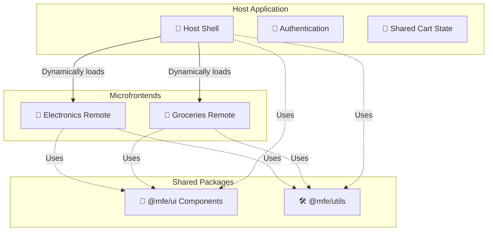

# Microfrontend-Commerce-System
A scalable microfrontend-based e-commerce platform built with React and Webpack Module Federation, featuring independent deployments, shared cart, and centralized authentication.

# 🛍️ Modular Commerce Platform (Microfrontend Architecture)

---

## 🚀 Overview

A **production-grade microfrontend e-commerce platform** built using **React, Webpack 5 Module Federation**.

**Live Demo:** [https://microfrontend-commerce-system-eight.vercel.app/login](https://microfrontend-commerce-system-eight.vercel.app/login)

This project demonstrates how to build a **scalable frontend architecture** where multiple independent applications (microfrontends) work together as a single system while maintaining **independent development and deployment pipelines**.

---

## 🧠 Key Highlights

- Microfrontend architecture using **Module Federation**
- Independent deployment of each application
- Shared cart across multiple microfrontends
- Centralized authentication system
- Monorepo setup using Turborepo
- Deployed on Vercel for demo purposes (AWS CI/CD proposed for scale)
- Performance optimized and production-ready setup

---

## 🏗️ Architecture

### 🔹 Host (Shell App)
- Handles routing and navigation
- Manages authentication
- Maintains global state (cart, user)
- Dynamically loads microfrontends

---

### 🔹 Microfrontends (Remotes)

- 🥦 Groceries
- 📱 Electronics

Each microfrontend:
- Built independently
- Uses Redux + Saga
- Exposes routes/components via Module Federation

---

### 🔹 Shared Packages

- UI Component Library (Button, Header, Card)
- Utility functions

---

## 🧭 Architecture Diagram

---

## ⚙️ Tech Stack

- React.js
- Webpack 5 (Module Federation)
- Redux + Redux Saga
- Turborepo / Nx (Monorepo)
- Mock Service Worker (MSW)
- Vercel (Demo Deployment)
- AWS (S3, CloudFront, CodePipeline, CodeBuild) - *Proposed Architecture*

---

## 🔥 Features

### 🧩 Microfrontend Integration
- Dynamic remote loading using Module Federation
- Lazy loading with fallback UI
- Independent builds and deployments

---

### 🛒 Shared Cart Across Applications
- Add products in one microfrontend
- Access the same cart in another microfrontend
- Cart managed at host level
- Persisted using localStorage

---

### 🔐 Authentication
- Centralized login system
- Token-based authentication
- Protected routes
- Token shared across microfrontends

---

### 📡 Communication Strategy
- URL-based routing (primary)
- Custom events (header updates)
- Shared modules for cross-app communication

---

### ⚡ Performance Optimization
- Code splitting and lazy loading
- Shared dependency optimization

---

### 🚨 Error Handling
- Error boundaries per microfrontend
- Retry mechanism for failed remote loading
- Graceful fallback UI

---

## 📸 Screenshots

Please refer to the repository's `docs/screenshots` folder or view the live demo link to see the updated Host Application, Electronics Microfrontend, and Groceries Microfrontend. You can seamlessly navigate through the shared header layout across these independently deployed microfrontends.

---

## 📁 Project Structure
